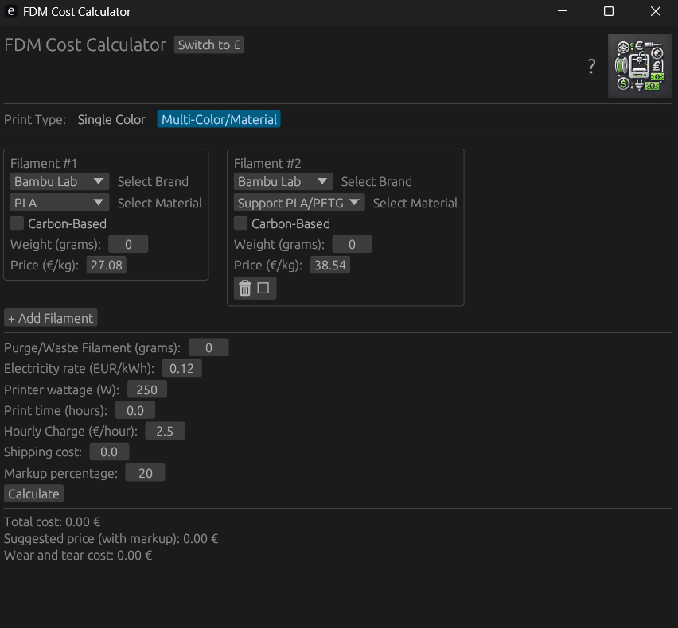

# FDM Cost Calculator

The **FDM Cost Calculator** is a lightweight, user-friendly desktop application designed to calculate the cost of FDM (Fused Deposition Modeling) 3D prints. It provides a precise breakdown of costs based on filament usage, electricity, printer wear and tear, and shipping. Additionally, it supports customizable profit margins and currency switching, making it ideal for hobbyists and professionals alike.

---

## Features

- **Comprehensive Cost Calculation**:
  - Factor in filament cost, electricity rate, printer wattage, wear and tear, and shipping.
  - Supports up to 16 materials for multi-color/material prints.

- **Profit and Pricing Tools**:
  - Automatically calculate suggested pricing with customizable profit margins (10%, 20%, 30%, 50%, 100%).

- **Dynamic and Intuitive UI**:
  - Toggle between Single-Color Mode and Multi-Color/Material Mode.
  - Dynamic scrolling and three-column layout for multi-color/material inputs.

- **Currency Support**:
  - Seamlessly switch between USD ($), EUR (€), and GBP (£).

- **Secure and Local-Only Data**:
  - No data storage—your inputs remain local to your device.
  - Export functionality planned for future releases.

---

## Installation

### Prerequisites

Before using the **FDM Cost Calculator**, ensure you have the following installed:

- **Rust**: Download and install the latest stable version of Rust from the [official website](https://www.rust-lang.org/).
- **Cargo**: Included with Rust, Cargo is the package manager for this project.

### Steps to Install and Run

1. **Clone the Repository**:
    ```bash
    git clone https://github.com/dmriding/fdm_cost_calculator.git
    cd fdm_cost_calculator
    ```

2. **Build the Project**:
    Use Cargo to download dependencies and compile the project:
    ```bash
    cargo build
    ```

3. **Run the Application**:
    Launch the app with:
    ```bash
    cargo run
    ```

The **FDM Cost Calculator** GUI will open, ready for use.

---

## How to Use

### Input Fields

- **Filament Details**:
  - Specify cost per kilogram, brand, material, weight (grams), and carbon-based status (if applicable).
- **Electricity**:
  - Enter your local electricity rate (e.g., EUR/kWh) and your printer’s wattage (W).
- **Print Time**:
  - Provide the estimated time required for the print in hours.
- **Markup and Shipping**:
  - Adjust the markup percentage for profit margins and include shipping costs.

### Multi-Color/Material Support
- Toggle between **Single-Color Mode** and **Multi-Color Mode**.
- In Multi-Color Mode, add up to 16 materials with detailed individual cost inputs.

### Currency Switching
Click the currency button to cycle through USD ($), EUR (€), and GBP (£). All costs will update to reflect the selected currency.

### Calculation Results
Once all inputs are provided, click **Calculate** to compute:
- **Total Cost**: Combines filament, electricity, wear and tear, and shipping costs.
- **Suggested Price**: Includes your chosen profit margin.
- **Profit Estimates**: Shows potential earnings at 10%, 20%, 30%, 50%, and 100% margins.

---

## Screenshots

### Single-Color Mode


### Multi-Color/Material Mode


---

## Troubleshooting

### Common Issues
- **Missing Dependencies**:  
  If you encounter errors related to missing dependencies, run:
  ```bash
  cargo build
  ```

- **Crashes or Bugs**:  
  Please report any issues in the repository’s [Issues section](https://github.com/dmriding/fdm_cost_calculator/issues).

---

## Roadmap

Here are some of the planned features for future releases:
1. **Slicer Integration**:
   - Import filament usage, print time, and costs directly from slicers like Cura, PrusaSlicer, or Bambu Studio.
2. **Advanced Filament Management**:
   - Support for filament density and spool management.
3. **Export Functionality**:
   - Export cost breakdowns to PDF or CSV for sharing or recordkeeping.
4. **Platform Fee and Tax Calculations**:
   - Include fees for platforms like Etsy and Amazon, as well as sales tax rates.
5. **Optional Cloud Syncing**:
   - Only if requested by users, with encryption and full user control.
6. **Open-Source Enhancements**:
   - Allow the community to contribute features and improvements.

---

## Feedback and Support

Your feedback is invaluable! If you encounter any bugs, have feature requests, or want to share general feedback, here’s how you can help:

1. **Report Bugs**: Open an issue in the [Issues section](https://github.com/dmriding/fdm_cost_calculator/issues) and use the provided bug report template.
2. **Request Features**: Have an idea for improvement? Submit a feature request in the [Issues section](https://github.com/dmriding/fdm_cost_calculator/issues).
3. **General Feedback**: Leave a comment or suggestion directly on the repository.

Thank you for helping make FDM Cost Calculator better! 🚀

---

## Contribution

Contributions are welcome! If you have ideas for improving the app:
- Fork the repository.
- Open a pull request with your changes.
- Submit feature requests or bug reports in the [Issues section](https://github.com/dmriding/fdm_cost_calculator/issues).

For more details, check out the [Contributing Guidelines](CONTRIBUTING.md).

---

## License

This project is licensed under the MIT License. See the [LICENSE](LICENSE) file for details.
